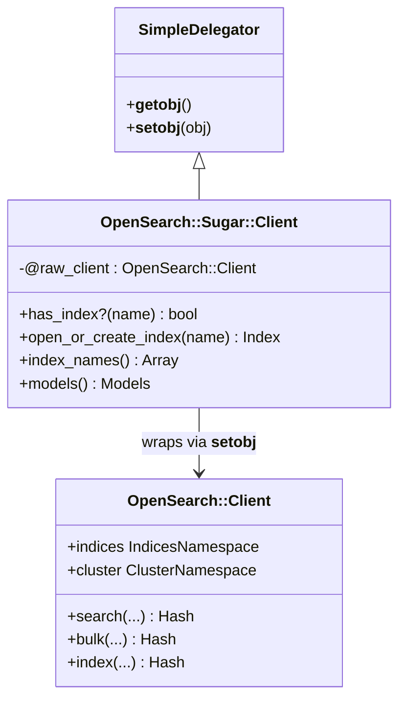

# ADR-001: Use SimpleDelegator to Wrap OpenSearch::Client

## Status

Accepted

## Date

2026-04-28

## Context

`OpenSearch::Sugar::Client` needs to provide convenient, higher-level methods (e.g., `has_index?`,
`open_or_create_index`, index management helpers) while also giving callers access to the full
`OpenSearch::Client` API. The OpenSearch Ruby client exposes a large, versioned surface area —
cluster operations, document APIs, index APIs, ML Commons, and more — that would be impractical
to wrap exhaustively and expensive to keep in sync as the upstream client evolves.

Options considered:

- **Inheritance** — subclass `OpenSearch::Client` directly
- **Manual delegation** — write `def_delegator` calls for every method needed
- **`SimpleDelegator` (Forwardable)** — wrap the client via Ruby's built-in delegation mechanism
- **Composition with `method_missing`** — forward unknown calls via `method_missing`/`respond_to_missing?`

## Decision

We use `SimpleDelegator` from Ruby's standard library to wrap an `OpenSearch::Client` instance.
`Client` inherits from `SimpleDelegator`, calls `__setobj__` with the raw client at initialization,
and adds Sugar methods on top.

```ruby
class OpenSearch::Sugar::Client < SimpleDelegator
  def initialize(**kwargs)
    @raw_client = OpenSearch::Client.new(**kwargs)
    super(@raw_client)
  end

  # Sugar methods
  def has_index?(name)
    indices.exists?(index: name)
  end

  def open_or_create_index(name, ...)
    # ...
  end
end

# Call site — Sugar method
client.has_index?("my_index")

# Call site — delegated to raw OpenSearch::Client transparently
client.search(index: "my_index", body: { query: { match_all: {} } })
client.cluster.health
client.bulk(body: operations)
```

The raw client remains accessible via `__getobj__` (or an explicit `raw_client` accessor) when
callers need it explicitly.

## Consequences

### Positive

- **Zero maintenance burden for the full API**: every current and future `OpenSearch::Client`
  method is automatically available without any wrapper code.
- **No abstraction trap**: callers are never forced to find a Sugar equivalent; they can drop
  through to the raw client at any time.
- **Official documentation applies directly**: users can read opensearch-ruby docs and apply
  them without translation.
- **Transparent migration**: code already written against `OpenSearch::Client` works without
  modification when the object is a `Sugar::Client`.

### Negative

- **`is_a?` / `instance_of?` surprises**: `SimpleDelegator` instances do not report as instances
  of the wrapped class. Callers relying on `client.is_a?(OpenSearch::Client)` will get `false`.
- **Method resolution ambiguity**: if Sugar adds a method with the same name as a raw-client
  method, the Sugar method wins silently. This requires discipline when naming Sugar helpers.
- **`SimpleDelegator` is less common than plain composition**: contributors unfamiliar with
  Ruby's delegator classes may find the inheritance unusual.

### Neutral

- `__getobj__` / `__setobj__` are available for testing and introspection but are not part of
  the public Sugar API.
- Adding Sugar methods that conflict with upstream client methods is a breaking change; names
  must be chosen carefully.

## Alternatives Considered

**Inheritance from `OpenSearch::Client`**
Rejected because `OpenSearch::Client` is not designed for subclassing; its initializer and
internal wiring make safe subclassing fragile and likely to break across upstream releases.

**Manual delegation with `Forwardable`**
Rejected because it requires enumerating every method to forward. Any new method added to the
upstream client would be invisible until manually added here — exactly the maintenance trap we
want to avoid.

**`method_missing` / `respond_to_missing?`**
Rejected because `SimpleDelegator` already implements this pattern correctly and is battle-tested
in Ruby's standard library. Rolling our own would duplicate that work with higher risk.

## Diagram



## Documentation Requirements

- The public README and HOWTO must explain that `Sugar::Client` exposes the full
  `OpenSearch::Client` API via delegation, and show side-by-side examples of Sugar methods
  vs. delegated calls.
- The EXPLANATION doc should describe the `SimpleDelegator` pattern and its implications for
  `is_a?` checks.
