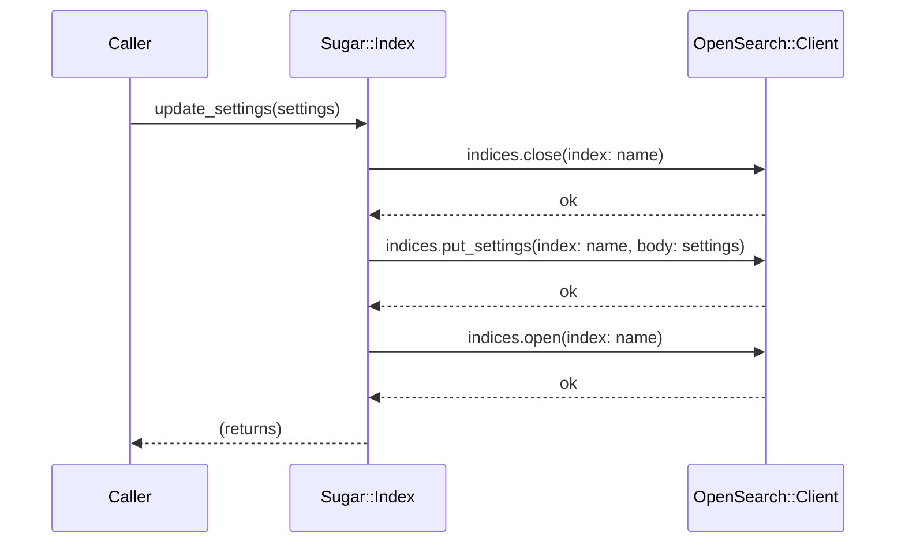

# ADR-002: Facade Pattern for OpenSearch::Sugar::Index

## Status

Accepted

## Date

2026-04-28

## Context

Several OpenSearch index operations require multiple coordinated API calls to complete safely.
The clearest example is updating certain index settings (e.g., analyzer configuration): OpenSearch
requires the index to be closed before applying the settings and then reopened afterward. If any
step fails partway through, the index can be left in an inconsistent state.

Other examples of multi-step sequences include:

- Applying settings or mappings that require a close/reopen cycle
- Introspecting settings or mappings (requires knowing which sub-keys to traverse)
- Managing aliases (creating, listing)
- Text analysis testing (`analyze` API)

Without a wrapper, callers must remember and correctly sequence every step every time. This is
error-prone and produces repeated, scattered boilerplate across application code.

Options considered:

- **Expose raw client methods only** — callers assemble sequences themselves
- **Module of helper functions** — stateless utility methods that accept an index name
- **`Index` class as a Facade** — an object that encapsulates the index name, holds a client
  reference, and exposes single-method operations for each multi-step sequence

## Decision

`OpenSearch::Sugar::Index` acts as a Facade over the raw index APIs. It holds the index name
and a reference to the `Sugar::Client`, and exposes single-method operations that internally
perform all necessary steps with consistent error handling.

```ruby
# Behind the scenes: close → put_settings → open
index.update_settings(
  settings: {
    analysis: { analyzer: { my_analyzer: { type: "standard" } } }
  }
)

# Behind the scenes: get_settings, traverse nested keys, return clean hash
index.settings

# Behind the scenes: close → open (if index exists); create (if not)
index = client.open_or_create("my_index")

# Single call for text analysis
tokens = index.analyze_text(analyzer: "my_analyzer", text: "Hello World")
```

Each method handles errors uniformly and raises `OpenSearch::Sugar::Error` (or a subclass) on
failure, rather than leaking raw transport exceptions from intermediate steps.

## Consequences

### Positive

- **Error-prone sequences become single calls**: callers cannot accidentally omit a step or
  leave an index closed after a settings update.
- **Consistent error handling**: all multi-step operations funnel through the same error
  boundary; callers handle one exception type.
- **Encapsulation**: the index name is carried by the object, eliminating repetitive
  `index: name` keyword arguments scattered throughout call sites.
- **Easier to test**: sequence logic is isolated in one class, making it straightforward to
  verify the correct sequence is called.

### Negative

- **Increased abstraction**: callers working with the raw client directly may find it confusing
  that `Index` and `Client` both offer some overlapping capabilities (e.g., `update_settings`
  exists on both, with `Index#update_settings` being the preferred single-object entry point).
- **Performance transparency**: the automatic close/reopen cycle for settings updates is hidden
  from callers. A caller unaware of this could be surprised by the two extra API calls and the
  brief unavailability of the index.

### Neutral

- `Index` objects are lightweight value-like wrappers; they do not cache state from OpenSearch
  and always fetch fresh data on each call.
- The Facade does not prevent callers from accessing the raw client via `index.client` (or
  through the delegated `Sugar::Client`) when they need finer control.

## Alternatives Considered

**Raw client methods only**
Rejected because it pushes multi-step orchestration into every call site. The close/reopen
sequence for settings updates is particularly easy to get wrong (e.g., forgetting to reopen
after a failure).

**Module of stateless helper functions**
Rejected because it requires passing the index name (and client) on every call, which is
repetitive. It also makes it harder to build a coherent, discoverable API — callers would
need to know which helpers to compose for each task.

## Diagram



## Documentation Requirements

- HOWTO must note that `update_settings` for analyzer-related settings automatically performs
  the close/reopen cycle and that the index is briefly unavailable during the operation.
- EXPLANATION should describe the Facade pattern and explain why certain operations require
  closing the index.
