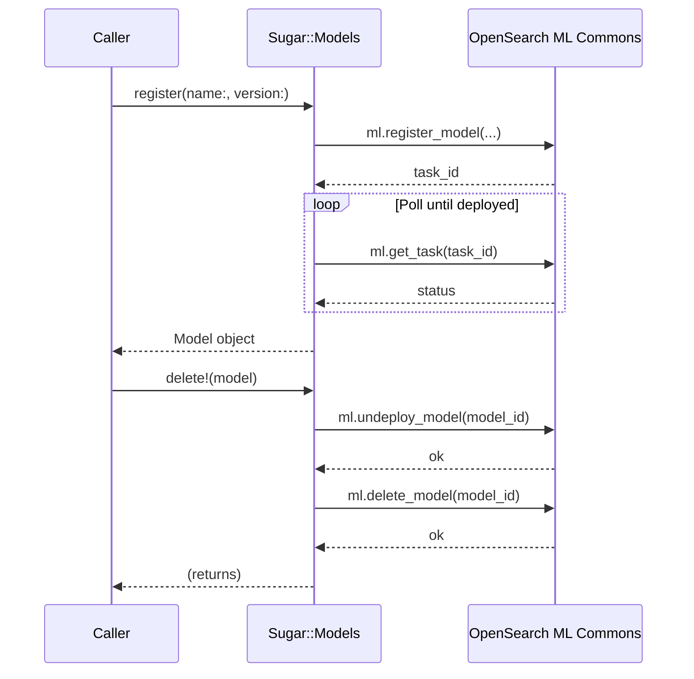

# ADR-003: Repository Pattern for OpenSearch::Sugar::Models

## Status

Accepted

## Date

2026-04-28

## Context

OpenSearch ML Commons stores models with internal IDs that are opaque UUIDs assigned at
registration time. Callers typically know a model by its human-readable name or a short
nickname, not its UUID. Retrieving, deploying, and deleting a model through the raw client
requires:

1. Listing all models (paginated)
2. Scanning results to match by name or ID
3. Using the resolved UUID in subsequent calls

This lookup-then-act sequence must be repeated at every call site that needs to work with a
model by name. Additionally, the ML model lifecycle has strict ordering requirements:

- A model must be registered and fully deployed before it can be used
- A model must be undeployed before it can be deleted

Without a dedicated abstraction, callers are responsible for both the lookup logic and the
lifecycle sequencing — producing fragile, repetitive code.

Options considered:

- **Raw client calls at each call site** — callers handle lookup and lifecycle themselves
- **Module of helper functions** — stateless helpers that accept a client and model identifier
- **`Models` class as a Repository** — an object bound to a client that treats ML models as
  first-class resources and unifies lookup, lifecycle management, and pipeline construction

## Decision

`OpenSearch::Sugar::Models` implements the Repository pattern. It is accessed via
`client.models` and provides a unified interface for all ML model operations. Lookup accepts
a name, UUID, or partial name match via `[]`:

```ruby
models = client.models

# Register and wait for deployment (blocks until deployed)
model = models.register(
  name: "huggingface/sentence-transformers/all-MiniLM-L12-v2",
  version: "1.0.1"
)

# Look up by name, UUID, or partial match
model = models["all-MiniLM-L12-v2"]
model = models["3a4b5c6d-..."]   # UUID

# List all registered models
all_models = models.list

# Delete safely (undeploys first)
models.delete!(model)

# Build an ingest pipeline for embeddings
models.create_pipeline(
  name: "embedding_pipeline",
  model: model.name,
  field_map: { "text" => "text_embedding" }
)
```

The `Models` class hides the paginated list API, name/ID resolution, and the undeploy-before-delete
requirement behind these single-purpose methods.

## Consequences

### Positive

- **Unified lookup**: callers do not need to know whether they have a name or UUID; `[]` resolves
  either, hiding the paginated scan.
- **Lifecycle safety**: `delete!` always undeploys before deleting; callers cannot accidentally
  delete a deployed model and produce an error.
- **`register` blocks until deployed**: removes the need for callers to poll deployment status
  themselves.
- **Discoverable API**: all model operations are co-located on one object, making the surface
  easy to explore.

### Negative

- **Blocking `register`**: waiting synchronously for model deployment may be unacceptable in
  latency-sensitive contexts (e.g., a web request). Callers in those contexts must run
  registration in a background job.
- **Partial-match ambiguity**: `[]` with a partial name string will match the first result;
  if multiple models share a partial name, the result is non-deterministic. Callers must use
  sufficiently specific identifiers.
- **Pagination hidden**: `list` returns all models by iterating pages internally. For clusters
  with very large model catalogs this could be slow; there is no lazy/streaming alternative.

### Neutral

- `Models` does not cache; each `list` call hits OpenSearch. Callers that need repeated
  lookups in a tight loop should retrieve and store the model object themselves.
- The pipeline construction method (`create_pipeline`) is included here because pipelines are
  tightly coupled to a specific model ID. This is a design convenience, not a strict Repository
  concern.

## Alternatives Considered

**Raw client calls at each call site**
Rejected because the paginated lookup and lifecycle sequencing would be duplicated everywhere
models are used. The undeploy-before-delete requirement is easy to forget and results in
confusing OpenSearch errors.

**Module of stateless helper functions**
Rejected for the same reasons as in ADR-002: requires passing the client on every call,
produces a flat, less discoverable API, and makes it harder to enforce invariants like
blocking until deployment is complete.

## Diagram



## Documentation Requirements

- HOWTO must warn that `register` blocks and is not appropriate for use in a hot path.
- HOWTO must document the partial-match behavior of `[]` and recommend using explicit names
  or UUIDs where uniqueness matters.
- REFERENCE must document the `Models` public API with parameter types and return values.
