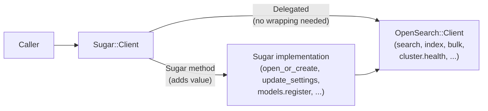

# ADR-007: Selective Sugar Surface — Intentionally Incomplete API Coverage

## Status

Accepted

## Date

2026-04-28

## Context

`opensearch-sugar` is a convenience wrapper, not a complete replacement for `opensearch-ruby`.
The OpenSearch HTTP API is large and continues to grow: document CRUD, search, aggregations,
bulk operations, cluster management, snapshots, ingest pipelines, ML Commons, and more.

Two approaches to API coverage were considered:

1. **Comprehensive wrapping**: provide Sugar methods for every (or nearly every) OpenSearch
   operation, so callers never need to call the raw client.
2. **Selective wrapping**: provide Sugar methods only for operations that genuinely benefit
   from a higher-level interface (multi-step sequences, complex defaults, common boilerplate).
   For everything else, rely on `SimpleDelegator` to pass calls through to the raw
   `OpenSearch::Client` transparently.

## Decision

Sugar wraps only operations where a higher-level interface provides meaningful value:

- **Multi-step sequences** that would otherwise be error-prone (e.g., close/update/reopen
  for settings changes — see ADR-002)
- **Lifecycle management** that requires orchestration (e.g., model registration and
  deployment — see ADR-003)
- **Common index management boilerplate** (`open_or_create_index`, `has_index?`, `index_names`)
- **Text analysis helpers** (`analyze_text`, `analyze_text_field`)

Document CRUD, search, bulk operations, aggregations, and cluster management are intentionally
left as raw-client operations:

```ruby
# Sugar — meaningful abstraction
index = client.open_or_create_index("products")
index.update_settings(settings)          # hides close/reopen
index.count                              # hides query body construction
model = client.models.register(...)      # hides polling loop

# Delegation — use the raw client directly
client.index(index: "products", body: doc)        # no benefit to wrapping
client.search(index: "products", body: query)     # DSL is already expressive
client.bulk(body: operations)                     # no benefit to wrapping
client.cluster.health                             # no benefit to wrapping
```

This is an explicit design choice, not an omission. The guiding principle:
> **"Use sugar where you want it, raw client where you need it."**

## Consequences

### Positive

- **Maintenance stays manageable**: every Sugar method is a liability that must be kept in
  sync with the OpenSearch API. Wrapping only what adds value keeps the surface small.
- **Full API always accessible**: because `Sugar::Client` uses `SimpleDelegator` (ADR-001),
  callers are never blocked by a missing Sugar method; the full raw API is always one call
  away.
- **Avoids redundant abstraction**: wrapping `client.search` into a Sugar method would not
  simplify anything — the OpenSearch query DSL is already a well-documented, expressive
  interface.
- **Clearer mental model**: callers learn which operations benefit from Sugar and which don't,
  rather than hunting for Sugar wrappers that don't exist or produce no benefit.

### Negative

- **Callers must know the raw client API**: for operations without Sugar equivalents, callers
  need to read `opensearch-ruby` documentation. Sugar does not hide this complexity.
- **Inconsistent abstraction level**: some operations are "high-level Sugar" and others are
  "raw client" in the same code. This boundary can feel arbitrary to new contributors.
- **No guided discovery for raw operations**: there is no machine-readable declaration of
  which operations are delegated vs. implemented; callers discover this through docs or
  source inspection.

### Neutral

- The `old_docs/DELEGATED_METHODS_ANALYSIS.md` file documents 19 specific examples of raw
  client calls used in the HOWTO guide and categorizes which have Sugar alternatives.
- New Sugar methods should be added only when they hide genuine complexity. A "thin wrapper
  that just passes arguments through" should not be added.
- The boundary will shift over time as new use cases emerge. Revisit this ADR before adding
  Sugar methods for document CRUD or basic search.

## Alternatives Considered

**Comprehensive wrapping**
Rejected. A comprehensive wrapper would need to track every OpenSearch API change, producing
a large maintenance surface and introducing lag between upstream API additions and Sugar
availability. It would also need to either replicate the entire query DSL (impractical) or
provide a lossy subset of it (worse than the raw API).

## Diagram



## Documentation Requirements

- HOWTO must demonstrate both Sugar methods and delegated raw-client calls side by side,
  making clear which is which.
- EXPLANATION must articulate the "use sugar where you want it, raw client where you need it"
  philosophy and explain why document CRUD and search are intentionally unwrapped.
- The `DELEGATED_METHODS_ANALYSIS.md` analysis in `old_docs/` should be kept or migrated to
  an appropriate location as a reference for which operations are and are not wrapped.
